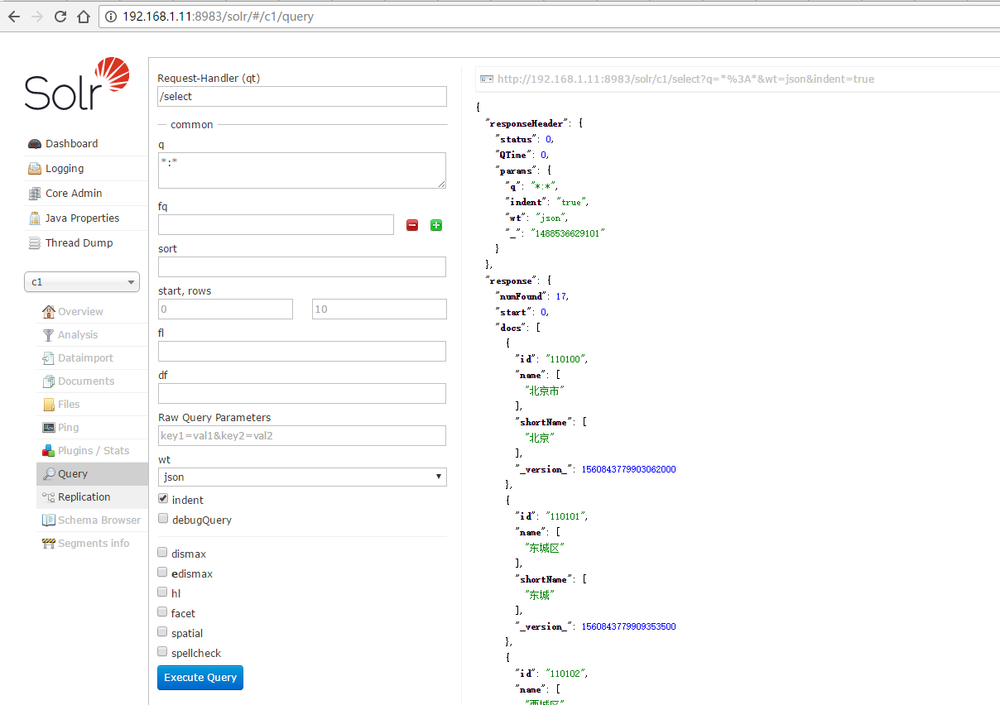
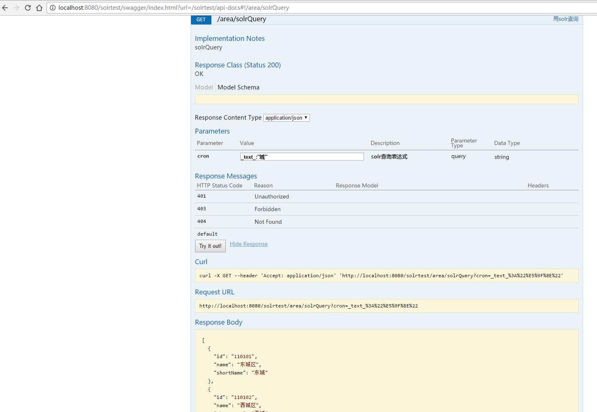

#solr demo
据说高版本的分词器会有些问题，这里选了5.x的一个版本
##服务器运行步骤:
1.下载solr[服务端](http://archive.apache.org/dist/lucene/solr/5.5.2/solr-5.5.2.tgz)

2.解压然后启动solr. 解压后进入solr的目录执行 ```./bin/solr start``` 启动solr,启动后可在http://${host}:8983/solr查看solr的ui页面.

3.创建实例```./bin/solr bin/solr create -c c1``` 这里的c1为实例名称.(至此，服务端的基本完成)

###客户端调用
客户端主要通过solrj的HttpSolrClient进行对服务器的操作.demo测试步骤:

1.导入 bin/area.sql的测试数据.

2.使用maven构建此工程.

3.打包或者使用ide部署此工程，打开工程主页进行测试.



